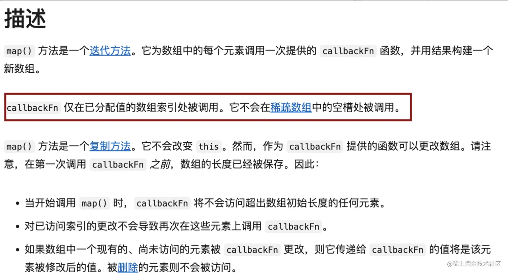

# Promise 对象池

我正在参加「掘金·启航计划」

# 前言

最近[leetcode](https://leetcode.cn/problemset/javascript/)专门出了一个 JavaScript 专栏，里面是一些和 javaScript 相关的题目，基本上是问一些日常使用或经典的工具函数的内部实现。感觉挺有意思，所以就刷了一遍，其中，Promise 对象池这个题让我印象比较深刻，平时有遇到过相关场景，但没细琢磨过实现原理，原题大意是给你一个异步函数数组 functions，和一个限制数 n，要求设计一个函数，用来执行数组 functions 中的所有异步函数，且最大并行执行数量不能超过 n。

# 题目

请你编写一个异步函数  `promisePool` ，它接收一个异步函数数组  `functions`  和  **池限制** `n`。它应该返回一个 promise 对象，当所有输入函数都执行完毕后，promise 对象就执行完毕。

**池限制**  定义是一次可以挂起的最多 promise 对象的数量。`promisePool`  应该开始执行尽可能多的函数，并在旧的 promise 执行完毕后继续执行新函数。`promisePool`  应该先执行  `functions[i]`，再执行  `functions[i + 1]`，然后执行  `functions[i + 2]`，等等。当最后一个 promise 执行完毕时，`promisePool`  也应该执行完毕。

例如，如果  `n = 1` , `promisePool`  在序列中每次执行一个函数。然而，如果  `n = 2` ，它首先执行两个函数。当两个函数中的任何一个执行完毕后，再执行第三个函数(如果它是可用的)，依此类推，直到没有函数要执行为止。

你可以假设所有的  `functions`  都不会被拒绝。对于  `promisePool`  来说，返回一个可以解析任何值的 promise 都是可以接受的。

**示例 1：**

    输入：
    functions = [
      () => new Promise(res => setTimeout(res, 300)),
      () => new Promise(res => setTimeout(res, 400)),
      () => new Promise(res => setTimeout(res, 200))
    ]
    n = 2
    输出：[[300,400,500],500]
    解释
    传递了三个函数。它们的睡眠时间分别为 300ms、 400ms 和 200ms。
    在 t=0 时，执行前两个函数。池大小限制达到 2。
    当 t=300 时，第一个函数执行完毕后，执行第3个函数。池大小为 2。
    在 t=400 时，第二个函数执行完毕后。没有什么可执行的了。池大小为 1。
    在 t=500 时，第三个函数执行完毕后。池大小为 0，因此返回的 promise 也执行完成。

**示例 2：**

    输入：
    functions = [
      () => new Promise(res => setTimeout(res, 300)),
      () => new Promise(res => setTimeout(res, 400)),
      () => new Promise(res => setTimeout(res, 200))
    ]
    n = 5
    输出：[[300,400,200],400]
    解释：
    在 t=0 时，所有3个函数都被执行。池的限制大小 5 永远不会满足。
    在 t=200 时，第三个函数执行完毕后。池大小为 2。
    在 t=300 时，第一个函数执行完毕后。池大小为 1。
    在 t=400 时，第二个函数执行完毕后。池大小为 0，因此返回的 promise 也执行完成。

**示例 3：**

    输入：
    functions = [
      () => new Promise(res => setTimeout(res, 300)),
      () => new Promise(res => setTimeout(res, 400)),
      () => new Promise(res => setTimeout(res, 200))
    ]
    n = 1
    输出：[[300,700,900],900]
    解释：
    在 t=0 时，执行第一个函数。池大小为1。
    当 t=300 时，第一个函数执行完毕后，执行第二个函数。池大小为 1。
    当 t=700 时，第二个函数执行完毕后，执行第三个函数。池大小为 1。
    在 t=900 时，第三个函数执行完毕后。池大小为 0，因此返回的 Promise 也执行完成。

**提示：**

- `0 <= functions.length <= 10`
- `1 <= n <= 10`

# 思路

题目很好理解，应用场景也比较常见，像 Chrome 浏览器，在同一个域名下，不同 GET/POST 请求的并发数量是 6，当某个页面的初始请求数量过多时，Chrome 浏览器最多会请同时请求 6 个，在这 6 个请求没有得到响应之前，后面的请求会置入队列里等待发送。当任一请求完成后，后续请求队列会补上一个……直至所有请求完成。

理一下思路，想要实现这样一个函数，首先应该维护一个长度为 n 的一部`异步函数`队列，进行初始化执行，并且在有`异步函数`执行完毕的时候，需要执行后续的函数。我尝试着按照自己的思路去实现，虽磕磕绊绊，但好在也实现了这个功能，不过看到那冗余的代码，让我知道这肯定不是最优解，秉承着高手在人间的想法，我果断的打开了该题的题解，虽然 JavaScript 专栏刚出不久，解题的大佬还不算多，不过我还是看到了我想要的答案。

# 题解

> **前置了解：**
>
> **Promise.all():** Promise.all() 方法接收一个 promise 的 iterable 类型,（注：Array，Map，Set 都属于 ES6 的 iterable 类型）的输入，并且只返回一个`Promise`实例，他会执行所有的 promise，当所有输入的 promise 都完成的时候，返回一个`Promise`实例调用 resolve()并返回一个由所有结果组成的数组。当输入的 promise 中存在任何一个被 reject 时，就会立即抛出错误，返回一个`Promise`实例调用 reject()返回其错误信息。
>
> **Promise.allSettled():** 和 Promise.all 类似，区别就是在某个 Promise 被 reject 时，不会中断剩余的 Promise，会在输入的所有 promise 都完成时（状态为`fulfilled` 或`rejected`），返回的 promise 才会 resolve，并返回一个对象数组， 包含所有 Promise 的状态和 promsie 结果。
>
> **Promise.race():** Promise.race(iterable)方法返回一个 promise，一旦迭代器中的某个 promise 解决或拒绝，返回的 promise 就会解决或拒绝。

由于我的题解实在拿不出手，这里 copy 了另外两个佬儿的题解。

    /**
     * @param {Function[]} functions
     * @param {number} n
     * @return {Function}
     */
    var promisePool = async function (functions, n) {
        // 使用 Set 存储正在执行的任务队列
        let queue = new Set();
        let resolved = [];

        for (const task of functions) {
            // 将正在执行的任务加入到队列中
            const x = task().then((res) => {
                // 任务执行完成后将结果存到 resolved 数组中
                resolved.push(res);
                // 完成后移出正在执行队列
                queue.delete(x);
            })
            queue.add(x);
            // 控制线程池执行最大数
            if (queue.size >= n) {
                await Promise.race(queue);
            }
        }
        // 执行完所有任务后才返回执行结果
        await Promise.allSettled(queue);
        return resolved;
    };

    /**
     * const sleep = (t) => new Promise(res => setTimeout(res, t));
     * promisePool([() => sleep(500), () => sleep(400)], 1)
     *   .then(console.log) // After 900ms
     */

    作者：夜风
    链接：<https://leetcode.cn/problems/promise-pool/solutions/2240055/shi-yong-promiserace-he-promiseallsettle-5ip2/>
    来源：力扣（LeetCode）
    著作权归作者所有。商业转载请联系作者获得授权，非商业转载请注明出处。

看完之后不得不感叹作者思路的巧妙。维护一个执行队列 queue。使用 for 循环，依次执行 functions 数组里的`异步函数`，当正在执行的`异步函数`到达限制后，使用 await+Promise.race 阻塞 for 循环，直至某个`异步函数`执行完毕，状态变更为`fulfilled/rejected` 后，将执行完毕的函数剔除队列，此时将继续 for 循环。然后继续阻塞…直至循环完毕。

最后 for 循环结束，还剩 n 个正在执行的`异步函数`，使用`Promise.allSettled()` 等待队列剩余的函数执行完毕后，把结果返回。

# 题解二

下面这个看起来就更简单了。

    /**
     * @param {Function[]} functions
     * @param {number} n
     * @return {Function}
     */
    var promisePool = async function(functions, n) {
        await Promise.all([...new Array(n)].map(async () => {
            while (functions.length) {
                await functions.shift()()
            }
        }))
    };

    /**
     * const sleep = (t) => new Promise(res => setTimeout(res, t));
     * promisePool([() => sleep(500), () => sleep(400)], 1)
     *   .then(console.log) // After 900ms
     */

    作者：月亮
    链接：<https://leetcode.cn/problems/promise-pool/solutions/2279225/js-promiseallsi-lu-by-yue-liang-ab-8p1h/>
    来源：力扣（LeetCode）
    著作权归作者所有。商业转载请联系作者获得授权，非商业转载请注明出处。

三行代码搞定。利用 Promise.all() + map + while 进行解题。看完之后不得不说，思路确实很清奇。

上一个题解是通过计数来控制并发数量，这个则是类似创建 n 个线程进行控制。初始化后先同步执行 n 个 Promise，使用 functions.shift()，每当 n 个 Promise 中有一个执行完毕后，都会继续执行下一个最新的异步函数，直至全部执行完毕。

当然，这里改变了原数组，如果不想改变原数组的话，可以单独维护一个变量 i，通过闭包，用来存储即将要执行的异步函数，也能达到类似的效果。

## 关于 Array.prototype.map

先看下关于 map 方法的描述：

callbackFn 仅在已分配值的数组索引处被调用，未被分配的数组索引，将跳过 callbakFn 的执行。而通过`new Array()`创建出的数组数组项默认是未分配的状态 `empty`，所以，如果直接进行 map，里面的回调函数是不会被执行的。需要使用`Array.prototype.fill()`填充一下默认值，或使用`扩展运算符` 进行一次浅拷贝，浅拷贝之后的数组，数组项未被分配时，会被填充为`undefined`。

# 结尾

实际需求肯定比题目要求要复杂，因此，想要在项目中使用，还需要根据项目需求，对代码进行润色，补充下边界等才能应用。

end.

