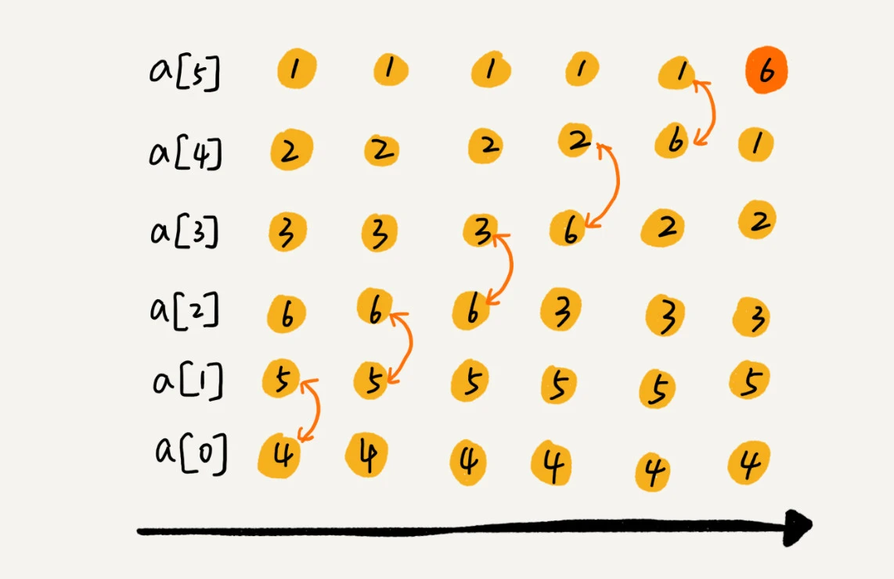
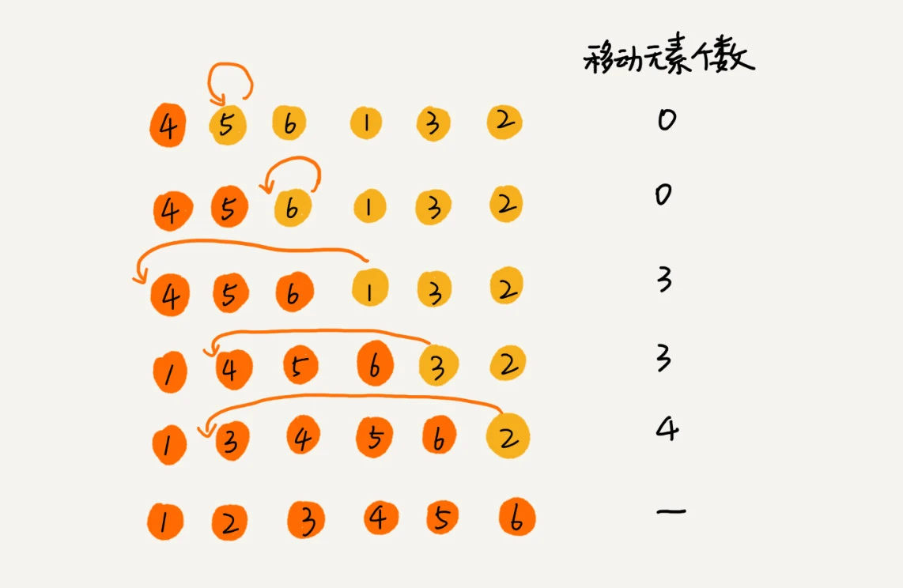
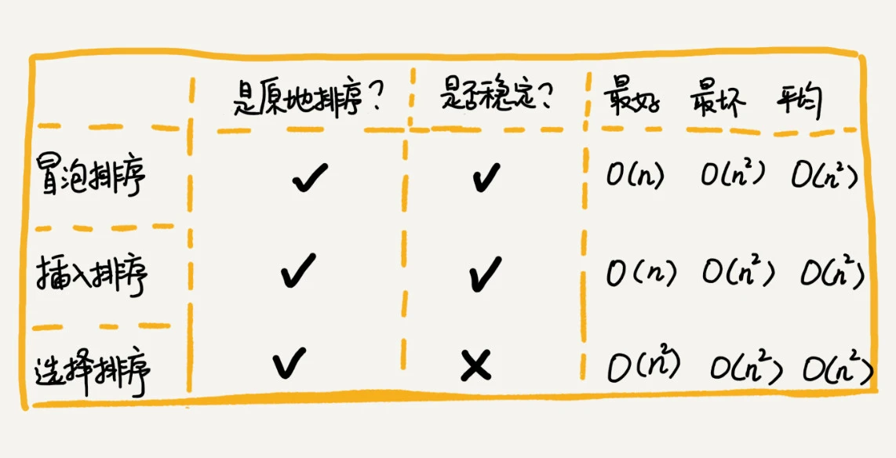

# 数据结构（五）排序


## 排序的分类

- 时间复杂度（O(n^2)）: 冒泡、插入、选择；
- 时间复杂度（O(nLogn)）: 快排，归并；
- 时间复杂度（O(n)）: 桶，计数，基数；

## 如何分析一个排序算法

### 执行效率（时间复杂度）：

1. 最好情况、最坏情况、平均情况；
2. 时间复杂度的系数、常数、低阶：时间复杂度反映的是数据规模 n 很大的时候的增长趋势，所以他会忽略掉系数、常数和低阶。但实际开发中，面对一些规模很小的数据时，为了相对精确的比较不同算法的执行效率，就需要把系数、常数、低阶也考虑进去。

### 内存消耗（空间复杂度）；

### 稳定性：指的是如果在待排序的序列中存在值相等的元素，经过排序后，相等元素之间的顺序是否发生变化

## 冒泡排序

从下标 0 开始，对相邻的数据进行比较，不满足条件则互换位置。

一轮冒泡会让至少一个元素移动到他应该在的位置。重复 n 次。就完成了 n 个数据的排序。

可以看到，经过一次排序后，6 已经挪到了末尾。执行 6 次后，排序完成。
两个优化点：

- 当某一轮冒泡期间，没有数据交换的操作，意味着已经达到完全有序，就无须在进行后续的冒泡操作了。
- 每一轮冒泡后，都会至少确认一个元素的位置于末尾。因此，每轮冒泡相对于上一轮都可以少比较一次。（如图例，第一轮冒泡需要比较 6 个元素，第二轮则只需要比较前 5 个元素）

```
// 冒泡排序
const bobbleSort = (arr) => {
  if (arr.length <= 1) return arr;
  for(let i = 0; i < arr.length; i++) {
    let flag = true;
    for(let j = 0; j < arr.length - i; j++) {
      if (arr[j] > arr[j + 1]) {
        let temp = arr[j];
        arr[j] = arr[j + 1];
        arr[j] = temp;
        flag = false;
      }
    }
    if (flag) break;
  }
}
```

## 插入排序

1. 首先将数组中的数据分为两个区间，已排序区间和未排序区间。（初始，已排序区间只有一个元素如第一个元素）
2. 插入排序的核心思想： 遍历未排序区间的元素，在已排序区间中找到合适的位置，插入进去，并保证已排序区间一直有序。知道未排序区间中的元素为空。
   
   把数据 a 插入已排序区间：需要拿 a 与已排序区间的元素依次进行比较，找到合适的位置插入进去。

```
// 插入排序
  const insertionSort = (arr) => {
    if (arr.length <= 1) return;
    // 1. 遍历未排序区间的元素。
    for (let i =1; i< arr.length; i++) {
      // 2. 当前要进行比较插入的未排序区间元素
      let value = a[i];
      // 3. value元素的上一个元素下标。
      let j = i - 1;
      // 4. 从 下标j开始，往下标0依次进行比较，直到找到value应该插入的位置
      for(; j >= 0; j--) {
        if（arr[j] > value）{
          arr[j + 1] = arr[j];
        } else {
          break;
        }
      }

      //插入数据value；
      arr[j + 1] = value;


    }
  }

```

## 选择排序

1. 类似于插入排序，也有已排序区间和未排序区间，已排序区间默认为空，
2. 在未排序区间找到最小值，插入已排序区间的末尾；

```
// 选择排序

const selectionSort = (arr) => {
  if (arr.length <= 1) return;
  for (let i = 0; i < arr.length; i++) {
    let minIndex = i;
    for (let j = i+1; j< arr.length; j++) {
      minIndex = arr[minIndex] < arr[j] ? minIndex : j;
    }
    const temp = arr[i];
    arr[i] = arr[minIndex];
    arr[minIndex] = temp;
  }
  console.log(arr);
  return arr;
}
```

## 比较冒泡排序和插入排序

冒泡排序的数据交换比插入排序的数据移动要复杂，冒泡排序需要三个赋值操作，而插入排序只需要一个

```
  // 冒泡排序
  if（a[j] > a[j + 1]） {
    let temp = a[j];
    a[j] = a[j + 1];
    a[j + 1] = temp;
  };
  //插入排序
  if (a[j] > value) {
    a[j + 1] = a[j];
  } else {
    break;
  };
```

总结：


