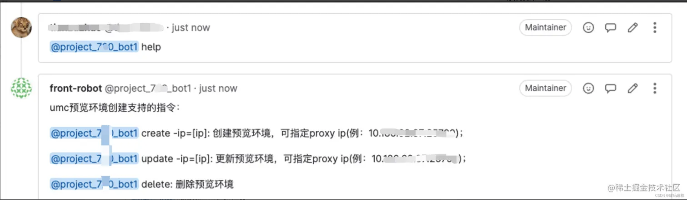
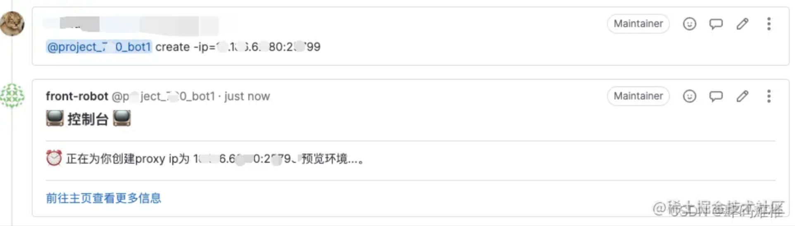
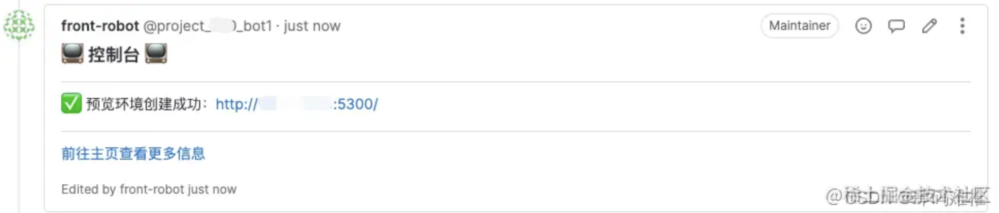
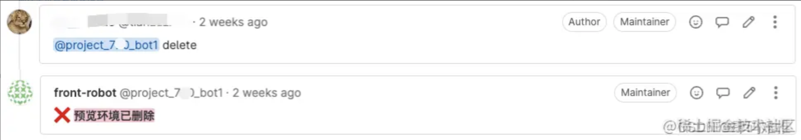
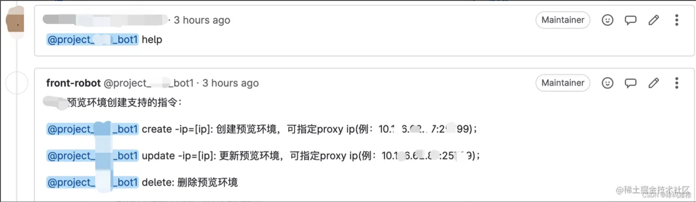
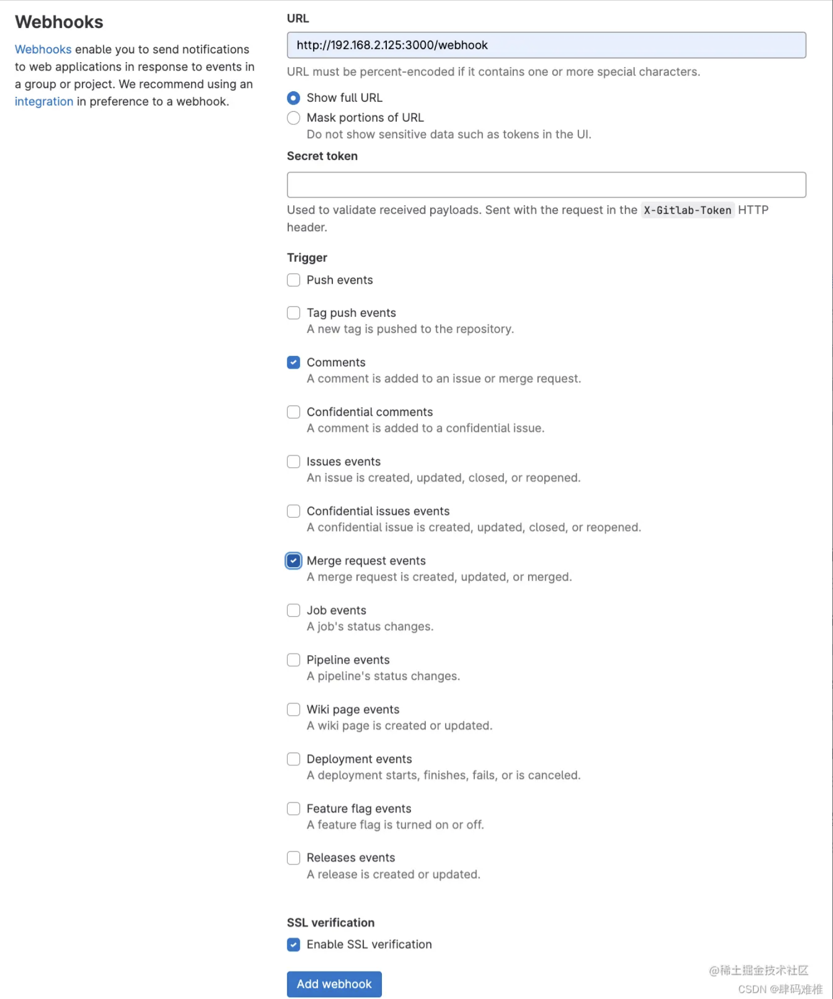
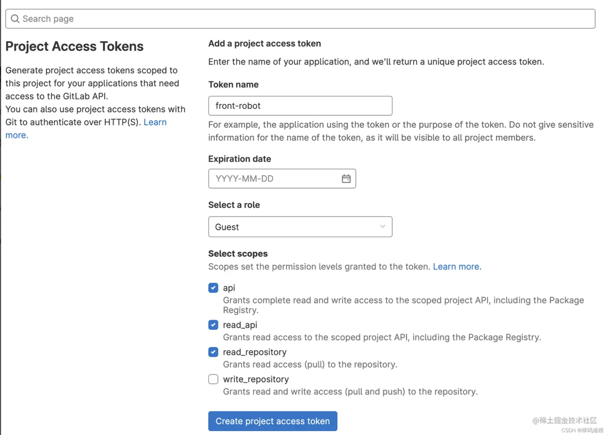

# 要是创建MR(PR)后它能自己创建一份预览环境就好了


懒也是人类进步的阶梯
一个因为懒而写出来的前端工具-前端项目预览 🙃

# 前言

在正文开始之前，不得不先提一下我们公司的代码合并流程。
日常开发中，当局者迷的我们在完成一个需求的时候常常会自我感叹：`这段代码写的真完美`（不是我）。而一些逻辑不自洽的代码或遗漏的边界问题可能就这么被忽略了过去。以至于当测试提 bug 的时候，我们看着自己的代码产生自我怀疑：`我*，我当时为啥这么写？没道理啊…` 。所以，我们需要一个代码复审者或者代码检查者这么一个角色，在我们把代码合并到 master 分支之前，帮我们检查一下，排除一些低级 bug 以及逻辑漏洞。

为了避免因未经审核的代码被合并到 master 分支上，相应的流程分三步：

1. 在远程仓库创建一个新分支（分支名称可以因任务而定，一般采用`feature/[任务号]` 或`fixbug/[任务号]` 等）,将我们的代码提交到这个新分支上。
2. 创建一个`merge request(pr)` 并指定复审者。
3. 复审者检查后，由复审者决定是要把代码合并到 master 上。

看起来没什么大问题，复审者的存在保证了代码的质量。能提前排除一些逻辑漏洞或潜在问题。但是对于前端来讲，由于`css不正交`的特性或者复审者对于该部分功能未必有一个完整的理解，有些时候，如果不打开一份该次变更之后的环境真的不能确认变更的结果。那么，不可避免的，复审者需要增加额外的一些操作：

1. 将当前分支的代码 clone 到本地。
2. 切换至当前分支。
3. yarn start，等待环境创建并查看。
4. 查看没问题后在切换回自己的分支。

虽然不算麻烦，可以忍，但我懒啊，于是，复审同事代码一个月后的我跟组长说出了标题那一段话。不出意外的，组长完美的发挥出“谁提出的问题，就由谁来解决”的~~陋习~~ 优良传统，这个任务就落到了我的头上。

> 💡 css 的不正交：你无法只看一个属性就知道这个属性对应的效果，你必须结合另一个或多个属性一起来看

# 正文

## 还是先看效果吧

- help 指令
  
- create 指令

  
  

- delete 指令
  

因为不是每个 mr 都需要一份预览环境，所以没有打算在 GitLab 的 pipeline 中部署。在和组长讨论了半下午后，最后决定使用 GitLab 的 webhook 与服务进行交互。并罗列了一些需求以及实现方式。

> 💡 GitLab/GitHub 都提供了 webhook 功能，如果你需要的话，它可以监听你所在项目的工作，并向你的服务器发送请求。

## 方案

搭建一个服务，通过 GitLab 的 webhook，监听 MR 的评论和状态，并进行相应处理。

## 技术栈

后端：KoaJs(2.0+) + TypeScript

前端：React + TypeScript + Vite

## 需求

- 通过在已创建的 mr 中评论的方式，与服务进行交互，并支持四个命令`help` 、`create` 、`update` 和`delete`：
  

- MR 被合并/关闭后，应自动删除当前 MR 可能创建的预览环境。
- 收到创建、更新、删除环境命令时应有实时反馈，告知用户结果（不管成功还是失败）。
- 项目具有完整的日志系统，以及错误处理机制。
- 服务崩溃的时候期望能收到邮件通知。
- 提供一个前端可视化页面，用于展示所有已创建的环境，并支持手动更新和删除。

## 思路

有了思路才好实现，先理一下主流程的大致思路：

1. 在 GitLab 创建 webhook，监听项目的评论和 MR 变化。
2. 在 GitLab 中设置访问 token 并设置相关权限，通过这个 token，在服务中调用 GitLab API，对项目进行相关操作。
3. 在服务中注册路由，用于接收 GitLab 传递过来的信息。
4. 解析 GitLab 传递过来的信息，得到`项目`名称 、`MR源分支`、`相关命令` 等信息。
5. 利用机器人的 GitLab 权限，在服务中拉取远程代码，并使用 Vite 抛出的\***\*`createServer`** API，搭建/更新环境。并在搭建成功/失败后。调用 GitLab API 在当前 MR 创建一个评论进行反馈
6. MR 合并时干掉这个环境。

## 实现

### 第一步：首先我们需要配置一下项目的 webhook

project -> settings -> webhook

 

GitLab 注册了 13 个事件。不过我们只需要关注他的`comment event`和`Merge Request events` 就够了。指定好服务的 url，选完点击创建后，每当项目创建了 MR，或新增了评论。GitLab 就会向指定的 url 发送请求，并带上相关的信息。

### 第二步：创建访问 token

project -> settings -> Access Tokens


给他起个名字，并赋予相应权限。点击创建后会得到一个 token，把这个 token 保存起来，用于之后在服务中调用 GitLab API。

### 第三步：在服务中注册路由，用于接收 GitLab 传递过来的信息。

```jsx
import Router from 'koa-router';
const router = new Router();

router.post('/webhook', (ctx, next) => {
  const body = getRequestBody(ctx, ProjectType.Umc);
  logger.info('GitLab event: ', body.object_kind);
  handleEvents(ProjectType.Umc, body);
  ctx.status = 200;
  next();
});
export default router;
```

可以根据 body.object_kind 得知此时触发的是 MR 事件还是 Comment 事件，并作出相对应的处理。

### 第四步：解析 gitlab 传递过来的信息，得到`项目`名称 、`MR源分支`、`相关命令` 等信息。

```jsx
// 处理MR变化
const changes = ['updated_at', 'merge_status'];
const handleMergeRequestChange = (payload: IMergeRequestParams) => {
  //获取项目id，mr描述，mrid，mr状态，源分支，mr变化信息。
  const projectId = payload.project.id;
  const { description, iid, state, source_branch } = payload.object_attributes;
  const changeItems = Object.keys(payload.changes);

  // 提取mr描述中的命令，只支持create命令
  const commandInfo = getParamsByDesc(description);

  let commentCtx = '';
  if (commandInfo?.error) {
    commentCtx = commandInfo.error;
  } else if (
    commandInfo?.command &&
    commandInfo.command !== CommandEnum.create
  ) {
    commentCtx = ':octocat: 命令无效，创建merge request时只支持create命令';
  }
  // 命令出错时的处理，调用GitLab API，在当前mr新增一个评论
  if (commentCtx) {
    GitlabService.updateComment(projectId, iid, commentCtx);
    return;
  }

  // 根据MR的状态决定是否创建/更新 或删除环境。
  switch (state) {
    case 'opened':
      if (!commandInfo) return;
      // 不是commit变更触发的merge event 不需要更新环境
      if (changeItems.length !== 1 || !changes.includes(changeItems[0])) {
        logger.info(`[mr: ${iid}]: 无效的merge event`);
        return;
      }
      createDev(
        iid,
        source_branch,
        projectId,
        TriggerEnum.desc,
        commandInfo?.params
      );
      break;
    case 'closed':
    case 'merged':
      deleteDev(projectId, iid);
      break;
  }
};
```

处理 comment event 与 MR event 类似，获取我需要的信息，检查命令的合法性以及 MR 的状态。

```jsx
// 处理comment event
const handleCommentsChange = (payload: ICommentParams) => {
  const { note } = payload.object_attributes;
  const commandInfo = getParamsByDesc(note);
  const { id: projectId } = payload.project;
  const { iid, source_branch, state } = payload.merge_request;
  if (!commandInfo) {
    return;
  }

  let commentCtx = '';
  if (commandInfo?.error) {
    commentCtx = commandInfo.error;
  } else if (state === 'closed' || state === 'merged') {
    commentCtx = ':octocat: 当前mr已关闭/已合并，不支持命令行评论';
  }
  if (commentCtx) {
    GitlabService.updateComment(projectId, iid, commentCtx);
    return;
  }

  switch (commandInfo.command) {
    case CommandEnum.help:
      devLogger.info(`接收到 help 命令, ${iid}`);
      addCommandHelpComment(projectId, iid);
      break;
    case CommandEnum.create:
      devLogger.info(`接收到 create 命令, ${iid}`);
      createDev(
        iid,
        source_branch,
        projectId,
        TriggerEnum.cmd,
        commandInfo.params
      );
      break;
    case CommandEnum.update:
      devLogger.info(`接收到 update 命令, ${iid}`);
      updateDev(iid, source_branch, projectId, commandInfo.params);
      break;
    case CommandEnum.delete:
      devLogger.info(`接收到 delete 命令, ${iid}`);
      deleteDev(projectId, iid, TriggerEnum.cmd);
      break;
    case CommandEnum.clear:
      devLogger.info(`接收到 clear 命令, ${iid}`);
      clearComments(projectId, iid);
      break;
  }
};
```

### 第五步：利用机器人的 GitLab 权限，在服务中拉取远程代码，并使用 Vite 启动环境

npm 包`shelljs`可以让我们在 node 里使用一些简单的 shell 命令，使用它创建一个环境目录并拉取代码

```jsx
// 部分代码
// 创建评论
await GitlabService.updateEnvComment(
  projectId,
  mergeRequestId,
  `:alarm_clock: 正在为你创建proxy ip为 ${proxyIP} 预览环境...。`
);

if (shell.cd(env.CODE_DIR).code !== 0) {
  throw new Error('Error: 存放代码的文件夹路径不正确');
}
if (!shell.which('git')) {
  throw new Error('Error, 没有git命令');
}
// 进入文件
if (shell.cd(`${projectName}-${mergeRequestId}`).code !== 0) {
  shell.mkdir(`${projectName}-${mergeRequestId}`);
  shell.cd(`${projectName}-${mergeRequestId}`);
}
// 根据分支克隆代码、yarn install
await execPromise(`git clone -b ${branch} ${env.PROJECT_CLONE_ADDR}`);
logger.info(`[mr:${mergeRequestId}]:项目克隆成功`);

shell.cd(projectName);
await execPromise('yarn install');
logger.info(`[mr:${mergeRequestId}]:项目所需npm包下载成功，即将启动项目`);

//启动环境并得到预览地址，将地址告知用户
const addr = await createDevServer(projectDir, mergeRequestId, proxyIP);

logger.info(`[mr:${mergeRequestId}]: 环境启动成功: address ${addr}`);
await GitlabService.updateEnvComment(
  projectId,
  mergeRequestId,
  `:white_check_mark: 预览环境创建成功：${addr}`
);

// export const execPromise = (cmd: string) =>
//   new Promise<void>((resolve, reject) => {
//     shell.exec(cmd, (code, _, stderr) => {
//       if (code === 0) {
//         resolve();
//       } else {
//         logger.error(`error cmd: ${cmd}`);
//         reject(stderr);
//       }
//     });
//   });
```

Vite 提供了 [createServer](https://cn.vitejs.dev/guide/api-javascript.html) API ，用于创建预览环境，我们可以通过这个 API 来启动 clone 的项目。不过要记得开一个子进程，在子进程里创建环境。因为 Vite 只提供了关闭环境的 API，没有提供销毁环境的 API。环境虽然关闭了，但他还在占用内存，过一段时间，服务就会因为内存溢出而挂掉（这 bug 让我一顿好修）。在子进程里创建环境，这样删环境的时候只需要把子进程 kill 掉就可以了。

```jsx
//createDevServer
import { createServer } from 'vite';

const server = await createServer(env.getViteConfig(projectPath, proxyIP));
await server.listen();
const network = server.resolvedUrls?.network ?? [];
process.send?.(network[0]);
```

### 第六步：MR 合并时干掉这个环境。

把子进程的 pid 存下来，注册一个监听事件，在 MR 合并的时候把进程 kill 掉

## 其他

- GitLab SDK`@gitbeaker/node` ，封装了 GitLab 的相关 API。可以省去我们自己封装 API 的时间。
- 前端有个预览环境的列表和一些 MR 信息，由于内容不多，所以保存在了 json 文件里。然后写几个请求，返回一个预览环境列表。
- 使用`log4js` 对项目进行日志管理，默认一个文件存储 15 天的信息。并且为了方便在故障的时候查看日志，还在前端加了个日志展示页面。（虽然样式有点粗糙，但是日志嘛，能看就行 🙃）

## end.

